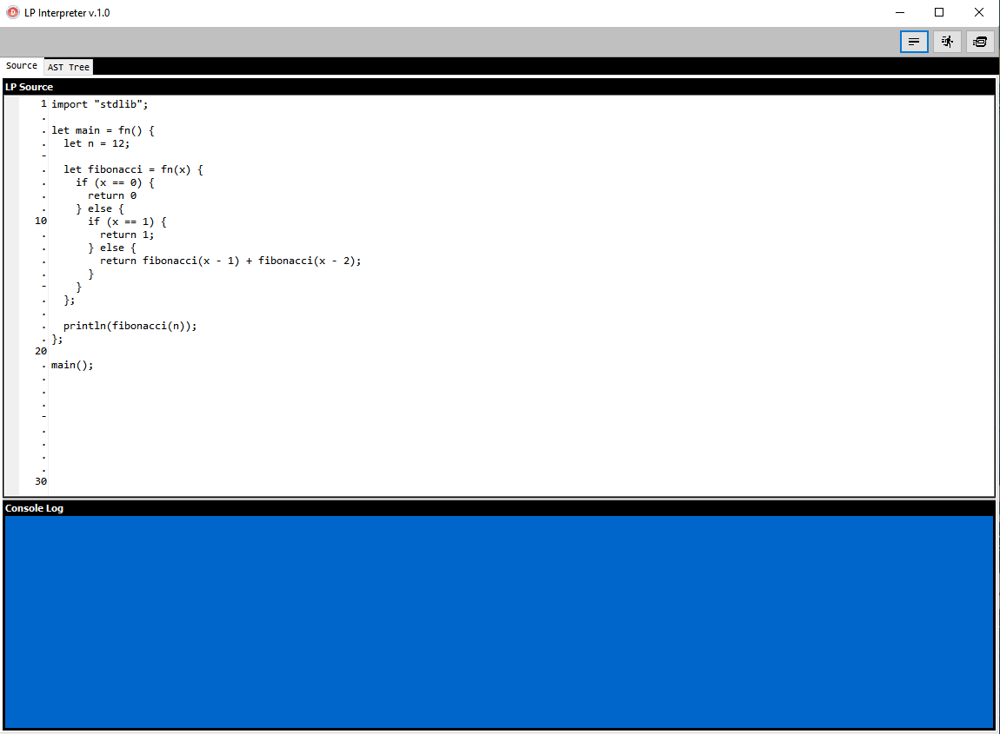
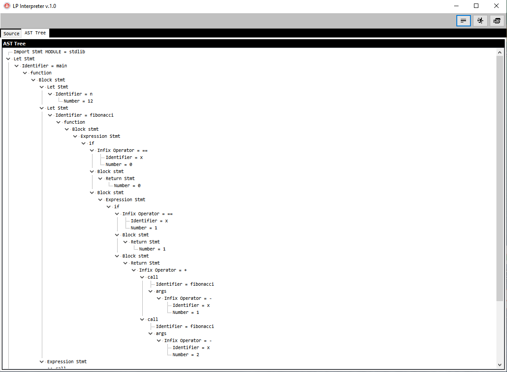
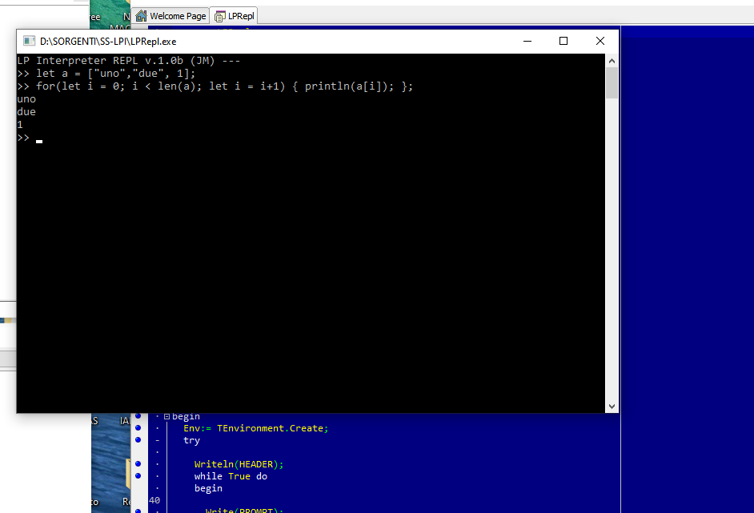

# monkey pascal interpreter with Garbage Collector mark-and-sweep
Code for “Writing an Interpreter in Go” by Thorsten Ball in Pascal.

#Array
let q = [{"CFGVAL":"XXX","CFGMOD":"LPI","CFGKEY":"MOD01"},{"CFGVAL":"XXX","CFGMOD":"LPI","CFGKEY":"MOD02"}];

#HashmMap
let q = {"CFGVAL":"XXX","CFGMOD":"LPI","CFGKEY":"MOD01"};

#Closure
let closure = fn(x) {
  return fn(y) {
    return (y + x);
  }
};

let b = closure(5);
println(b(5));
println(b(10));
println(b(15));

#anonymous function inline
let q = [1, 2, 3, 6, 1, 3, 45, 4];

let filter = fn(x, f) {
  let r = [];
  for(let i = 0;i < len(x); i := i+1){
    if(f(x[i])){
      r := push(r, x[i]);
    };
  };
  return r;
};

println(filter(q,fn(x) { return x<10; }));

#expandability
with builtins function

> Souce inline code testing

> AST inspector

> REPL

